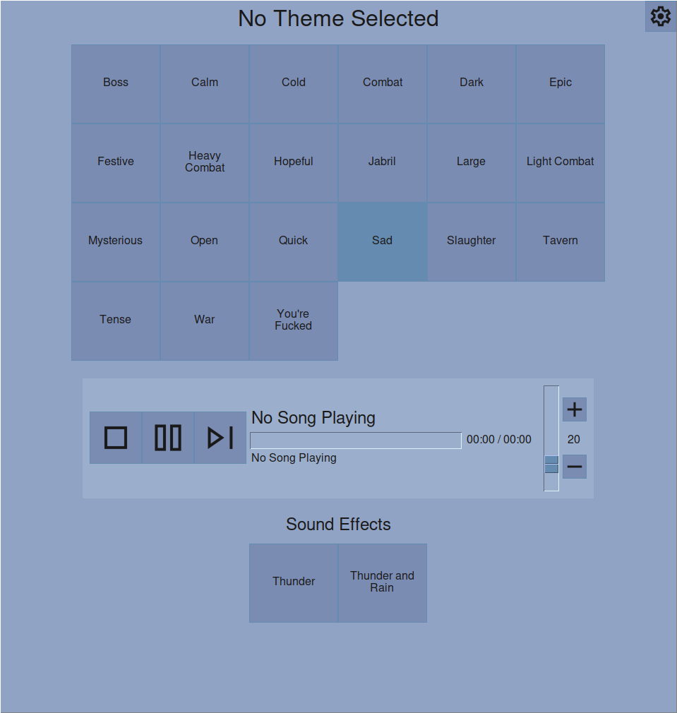
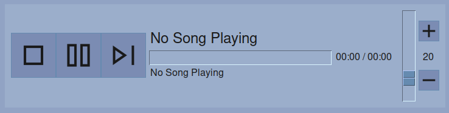
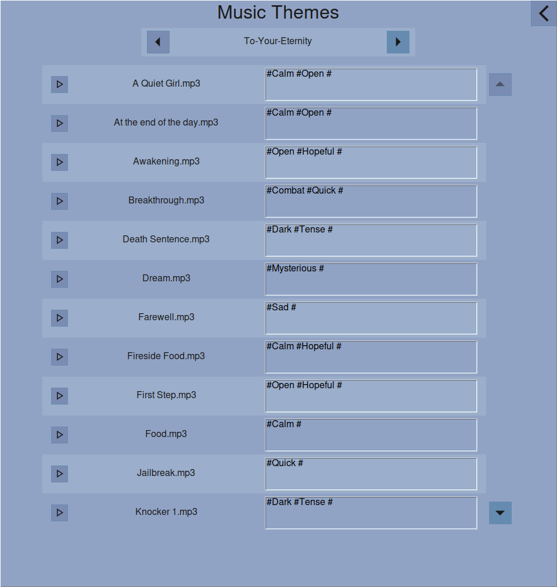

# RPG Music Tool

**Version: 0.6.0**

A desktop music and sound effects player for TableTop RPGs. \
Organize your local MP3 library into themes, queue up sound effects on demand, and keep the atmosphere alive during your sessions. \
Designed for offline use.

[](LICENSE)




## Features

- **Theme-based music playback** — Categorize your MP3 files into themes (e.g. "Combat", "Travel", "Tavern") and play random tracks from the selected theme.
- **Sound effects (SFX) support** — Assign directories for sound effects and play them instantly from the main tab.
- **Customizable UI** — Adjust UI scale, font size, button sizes, row counts, and color scheme to match your preference.
- **Cross-platform** — Works on Windows and Linux. Standalone executables are provided alongside the source code.
- **Version updater** — Built-in update checker notifies you when a new version is available.

## Table of Contents

- [Installation](#installation)
  - [Standalone Executable](#standalone-executable)
  - [From Source](#from-source)
- [Quick Start](#quick-start)
- [Tabs Overview](#tabs-overview)
  - [Main](#main)
  - [Song Paths](#song-paths)
  - [SFX Paths](#sfx-paths)
  - [Themes](#themes)
  - [Settings](#settings)
- [Configuration](#configuration)
- [Building from Source](#building-from-source)
- [Roadmap](ROADMAP.md)

## Installation

### Standalone Executable

Download the latest release for your platform from the [Releases](https://github.com/anomalyco/opencode/releases) section.

- **Windows** — Use the `.exe` file.
- **Linux** — Use the compiled binary (make sure it has execute permissions: `chmod +x <filename>`).

> **Note:** Mac is not officially supported at this time, but you should be able to install it from source.

### From Source

Requires **Python 3.12**.

```sh
pip install -r requirements_linux.txt   # Linux
pip install -r requirements_win.txt     # Windows
```

Then run:

```sh
python main.py
```

## Quick Start

1. **Add directories** — Go to the **Song Paths** tab and add your music folders using the file picker. Repeat in the **SFX Paths** tab for sound effects.
2. **Categorize songs** — Open the **Themes** tab and assign themes to each track. A single song can belong to multiple themes.
3. **Play** — Head back to the **Main** tab, pick a theme, and hit play.

## Tabs Overview

### Main

The default view. Select a music theme to play, control playback (play, pause, stop, skip), adjust volume, and trigger sound effects.

**Controls:**

| Control       | Action                                    |
|---------------|-------------------------------------------|
| Theme Button  | Start / switch music theme (random order) |
| Play / Pause  | Toggle playback (also `Space` key)        |
| Stop          | Stop playback                             |
| Skip          | Skip to next track                        |
| Volume Adjustment | Adjust volume                     |
| SFX Buttons   | Play individual sound effects             |



### Song Paths

Add, remove, and manage your music directories. Invalid paths are highlighted in red. The app creates a `songs.csv` file in each directory to track songs and their assigned themes.

- Add directories via the **Add Music Directory** button.
- Delete directories using the trash icon.
- Navigate between pages of directories using the arrow buttons.

### SFX Paths

Same as Song Paths but for your sound effect MP3s. SFX files are listed with their full filename and can be triggered from the Main tab.

### Themes

Browse songs within each music directory and assign themes. Features:

- **Predictive text input** — Start typing a theme name and get suggestions from your existing themes.
- **Inline playback** — Click the play icon next to any song to preview it.
- **Multi-theme assignment** — A song can belong to multiple themes.



### Settings

Customize the application:

**UI Settings:**

| Setting               | Range    | Description                          |
|-----------------------|----------|--------------------------------------|
| UI Scale              | 100–300% | Overall interface scaling            |
| Theme Button Scale    | 1–6      | Size of theme buttons on Main tab    |
| Theme Buttons per Row | 3–10     | Number of theme buttons per row      |
| Font Size             | 8–30 pt  | Application font size                |
| Row Count             | 4–24     | Number of rows shown per page        |
| SFX Location          | 0–1      | Show SFX on Themes tab or main tab   |

**Display Options:**

- **Display Full Paths on Themes Tab** — Show full file paths in the Main tab.
- **Display Full Paths in Settings** — Show full file paths in path management tabs.

**Color Settings:**

Customize the color palette with an eyedropper color picker:

- Primary Background
- Secondary Background
- Primary Accent (button background)
- Secondary Accent (button hover)
- Text / Icons

**Reset Settings** — Restore all settings to their default values with a single click.

## Configuration

All configuration is stored in a user config directory managed by `appdirs`:

| File                  | Purpose                              |
|-----------------------|--------------------------------------|
| `config.ini`          | Application settings and color scheme |
| `paths.csv`           | Saved music directory paths           |
| `sfx-paths.csv`       | Saved SFX directory paths            |
| `songs.csv` (per dir) | Song-to-theme mappings for that dir   |
| `sfx.csv` (per dir)   | SFX file list for that dir           |

## Building from Source

Build a standalone executable with the included build scripts:

**Linux:**

```sh
./build_scripts/build.sh -o <filename>
```

**Windows:**

```sh
build_scripts\build.bat -o <filename>
```

This installs `pyinstaller` if missing and compiles the app for your current platform. The executable will be in the `dist/` directory.

You can also run `pyinstaller` directly — see the [PyInstaller documentation](https://pyinstaller.org/) for more details.

## Roadmap

See [ROADMAP](docs/ROADMAP.md) for planned features and upcoming changes.

## Issues

If you find any issues or bugs, you can create an issure here on GitHub or directly create a pull request.
